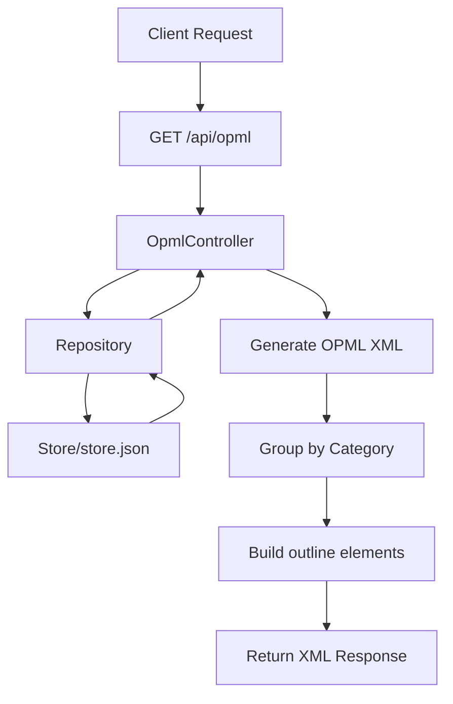

# OPML API Controller Implementation Plan

## Overview
Add an API controller that emits a valid OPML feed consisting of subreddit subscriptions from the Repository.

## Current State
- Serilog is configured with static logging ✓
- [`Repository`](RedditToOpml/Data/Repository.cs) class manages subscriptions with a `Subscriptions` property
- [`Subscription`](RedditToOpml/Data/Subscription.cs) class has `Subreddit` and `Category` properties
- RSS feed format: `https://www.reddit.com/r/{subreddit}/top.rss?t=week&limit=50`

## Implementation Steps

### 1. Add Controllers Support to Program.cs
Update [`Program.cs`](RedditToOpml/Program.cs) to add controller support:
- Add `builder.Services.AddControllers()` 
- Add `app.MapControllers()`

### 2. Create OpmlController
Create a new controller at `RedditToOpml/Controllers/OpmlController.cs`:
- GET endpoint at `/api/opml` or `/opml.xml`
- Inject `Repository` to access subscriptions
- Return `ContentResult` with XML content type

### 3. OPML XML Structure
Generate valid OPML 2.0 XML:

```xml
<?xml version="1.0" encoding="UTF-8"?>
<opml version="2.0">
  <head>
    <title>Reddit Subscriptions</title>
  </head>
  <body>
    <outline text="Technology" title="Technology">
      <outline type="rss" 
               text="r/ai_agents" 
               title="ai_agents" 
               xmlUrl="https://www.reddit.com/r/ai_agents/top.rss?t=week&limit=50"/>
    </outline>
  </body>
</opml>
```

### 4. Group by Category
Subscriptions should be grouped by their `Category` property, with each category as a parent outline element containing subreddit outlines.

## Architecture Diagram



## Files to Create/Modify

| File | Action |
|------|--------|
| `RedditToOpml/Controllers/OpmlController.cs` | Create |
| `RedditToOpml/Program.cs` | Modify - add controllers |

## OPML Endpoint Details

- **Route**: `GET /api/opml` or `GET /opml.xml`
- **Content-Type**: `application/xml; charset=utf-8`
- **Response**: Valid OPML 2.0 XML document

## RSS Feed URL Format
Each subreddit outline will have an `xmlUrl` attribute formatted as:
```
https://www.reddit.com/r/{subreddit}/top.rss?t=week&limit=50
```

Note: The `&` character must be escaped as `&` in XML.
